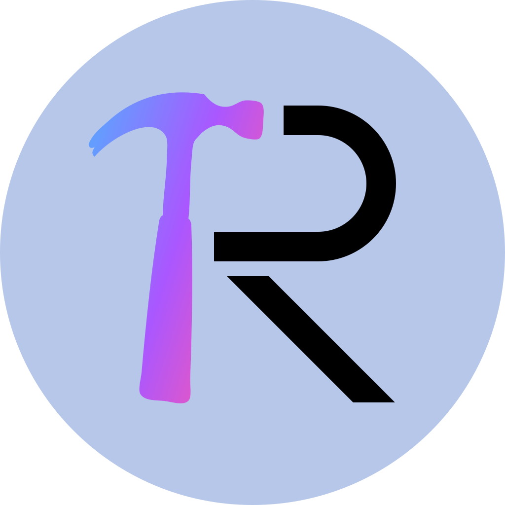

<div align="center">
    
    <h1>Craftive</h1>


[](./LICENSE)


[](https://gitee.com/zrz2013/craftive)

</div>

## Build & Run
0. Prerequisites:
   - The latest version of [Qt](https://qt.io/);
   - [Nlohmann JSON](https://json.nlohmann.me/);
   - A toolchain that supports C++26.
> [!NOTE]
> Only LLVM 22 is tested.
1. Clone this repository:
   ```
   git clone https://github.com/2013ZRZ/craftive.git
   cd craftive
   ```
2. Build:
   ```
   qmake
   make
   ```
> [!WARNING]
> You may need to specify your toolchain in `craftive.pro`. Otherwise, you may receive an error like that `make` couldn't find `clang++-22`, etc.
3. Run:
    ```
    ./out/craftive
    ```

## Translation
Coming soon on Weblate!

## Project Structure
```
craftive
├─ .clang-format
├─ .git/
├─ .gitattributes
├─ .gitignore
├─ LICENSE                  # BSD 3-Clause License
├─ Makefile                 # Auto-generated by qmake
├─ README.md
├─ assets/images/logo.svg
├─ craftive.pro             # qmake
├─ craftive_metatypes.json  # By MOC. Don't care it!
├─ include/
│  ├─ backward-cpp/
│  └─ md3-qml/              # Material Design 3 for Qt Quick (QML)
├─ locales/                 # Including TS files. I'm going to put it onto Weblate. 
├─ md3-core.qrc             # Qt Resources File for include/md3-qml/
├─ res.qrc                  # Qt Resources File for Craftive
└─ src/
    ├─ core                 # Backend (Almost complete)
    └─ frontend             # Working on!
```

## Licenses
This project, excluding `include/`, is under BSD-3-Clause License.

`include/backward-cpp/` is under MIT License.

`include/md3-qml/src/Core/` is under GNU Lesser General Public License, version 3 or later.

`include/md3-qml/3rdparty/material-color-utilities/` is under Apache License, version 2.0.

## Special Thanks
- [Qt](https://qt.io/)
- [Nlohmann JSON](https://json.nlohmann.me/)
- [Backward-cpp](https://github.com/bombela/backward-cpp)
- [Material Design 3 for Qt Quick (QML)](https://github.com/sudoevolve/material-components-qml)
